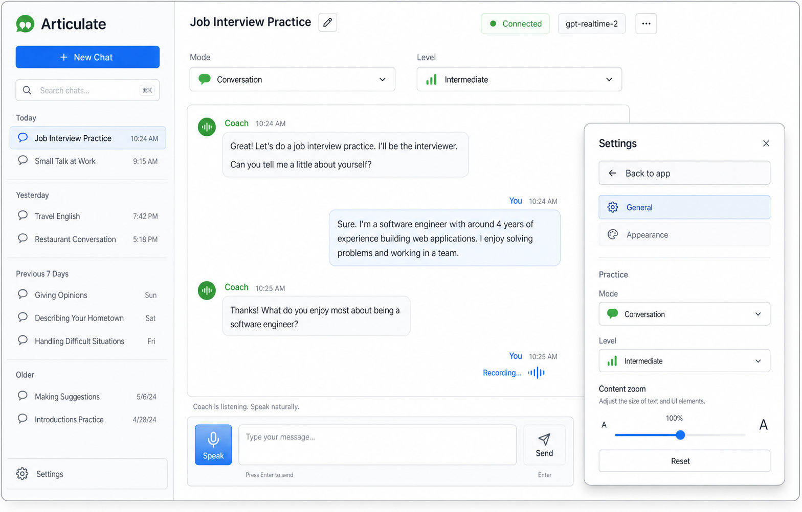

# Articulate

A web application for conversational English practice, powered by OpenAI Realtime and WebRTC.



## Overview

Articulate provides a focused environment for practicing spoken and written English with an AI coach. It supports different practice scenarios, proficiency levels, voice interaction, and typed prompts so users can work through conversation practice in the format that fits their context.

The app is built with a React/Vite client and a local Express API server. The browser connects to OpenAI Realtime through WebRTC, while the server handles Realtime call setup so the `OPENAI_API_KEY` stays out of client JavaScript.

## Features

- Realtime voice practice using OpenAI Realtime and `gpt-realtime-2`.
- WebRTC microphone capture, model audio playback, and Realtime data events.
- Practice modes for Conversation, Interview, Pronunciation, and Small Talk.
- Proficiency levels for adjusting the coaching context.
- Typed prompt fallback when speaking is not convenient.
- Persistent local chat history with search, rename, delete, and clear actions.
- Settings panel for current chat behavior and content zoom.
- Responsive layout for desktop, compact desktop, and mobile screens.

## Technical Stack

- React 19, Vite, and TypeScript for the web client.
- Express for the local API server.
- WebRTC data channels and media tracks for Realtime communication.
- OpenAI Realtime call setup through `/v1/realtime/calls`.
- Vitest for focused unit coverage.

## Requirements

- Node.js 24 or newer.
- npm 11 or newer.
- An OpenAI API key with available API credits.

## Setup

Create a local environment file:

```bash
cp .env.example .env.local
```

Add your API key:

```bash
OPENAI_API_KEY=your_api_key_here
PORT=8787
```

`PORT` is optional and defaults to `8787`. The `.env.local` file is ignored by Git and should not be committed.

Install dependencies:

```bash
npm install
```

## Development

Start the Express API server and Vite development server together:

```bash
npm run dev
```

Open the app at:

```text
http://localhost:5173
```

The API server runs on `http://localhost:8787`. During development, Vite proxies `/api` requests to the Express server.

## Validation

```bash
npm run lint
npm run test
npm run build
```

## Production Build

After building, the Express server can serve the compiled app:

```bash
npm run server
```

## Project Status

Articulate is a personal project for exploring realtime AI interaction in a practical language-learning workflow. The current version focuses on a local web experience with secure server-side Realtime setup and a responsive browser interface.
